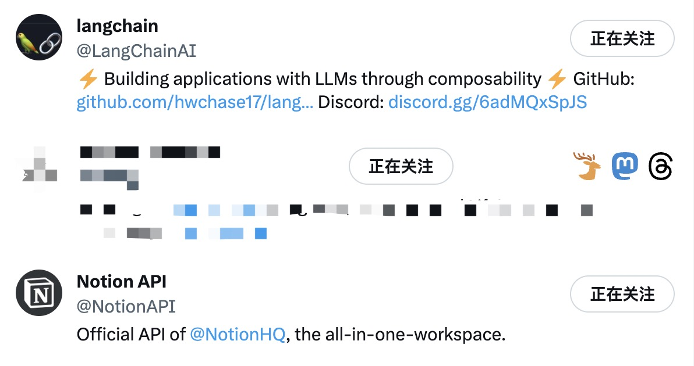

<h1 align="center">
T.M.D
</h1>

<p align="center">
Twitter Mastondon Threads
<br>
</p>



## 🙋‍♂️ What is this
This is a [UserScript](https://greasyfork.org/en/scripts/470290-t-m-d) of [Tampermonkey](https://chrome.google.com/webstore/detail/dhdgffkkebhmkfjojejmpbldmpobfkfo) to retrieve other social media details from Twitter's follow list.

## 📝 User List

### Format

Each user on a new line, without `@` in front of all names.
```
// T, M, D
LarchLiu, yansong@mas.to, larch.liu
```
or
```
// T, , D
LarchLiu, , larch.liu
```
or
```
// T, M
LarchLiu, yansong@mas.to
```
